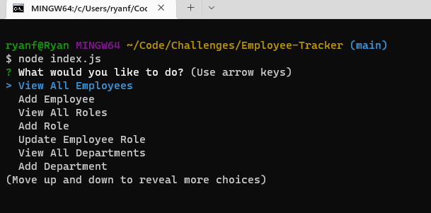
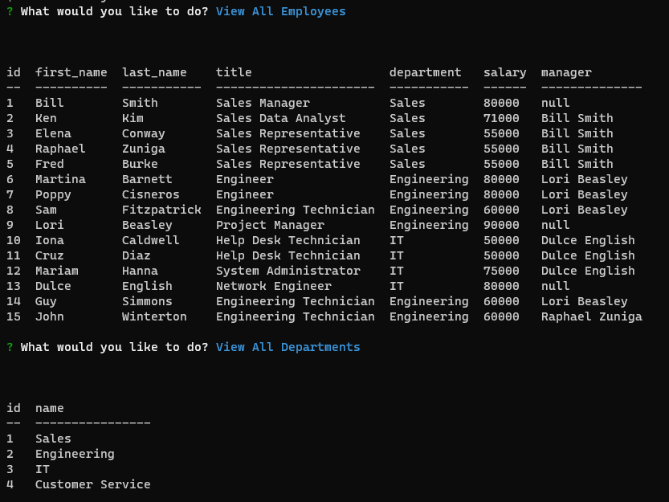
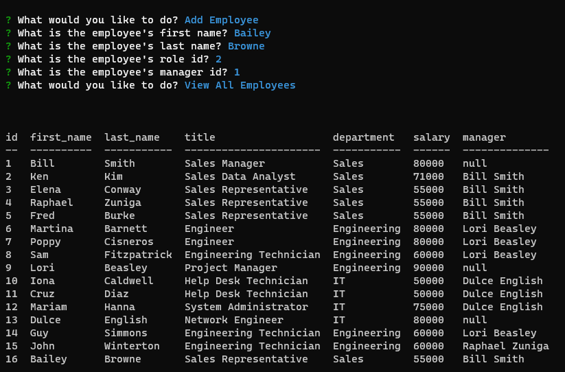
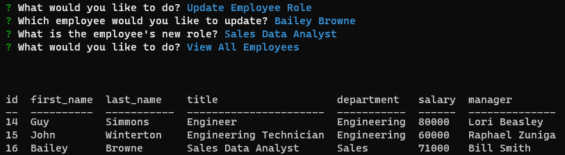

# Employee Tracker

## Description

The motivation for this project was to explore interfacing node.js with a database and to be able to use SQL queries to push and pull data from the database using MySQL2. An Employee Tracker was built with business owners as the intended users in mind, to provide them with a tool to organize and plan their employee roster and business strategies. The project solves the problem of interfacing with a database by provding the user with a streamlined interface for interacting with their data via the command line. By building this project, I further solidified my knowledge of using MySQL2 to read and write to and from an SQL database.

## Table of Contents

- [Installation](#installation)
- [Usage](#usage)
- [License](#license)
- [Contributing](contributing)
- [Tests](#tests)
- [Questions](#questions)

## Installation

This project uses the node modules:
- console.table ^0.10.0
- inquirer ^8.2.4
- mysql2 ^2.3.3

The command 'npm i' can be ran to install Node Package Manager, along with the above modules.

The schema.sql and seeds.sql files in the 'db' directory contain SQL queries for initializing and seeding the database, respectively.

## Usage

The application can be started by running the command 'node index.js' in the root project directory after installing the depenencies. Once ran, the user is presented with a circular menu that gives options for interacting with the db.

The underlying database contains three tables: employee, role, and department. Each menu option provides a way for the user to interact with the database tables. Selecting any of the "View" options presents the user with the respective table data created using the console.table module.

The user can select any of the three "Add" options to insert data into the respective table. The inquirer module was used to create the menu and provide a method for guiding the user through the data entry. The image below shows an example adding an employee to the db, with the user's input in blue text.

The user can update the role of an employee by selecting 'Update Employee Role'. This option first prompts the user to select an employee from a list of all employees, and then a role from a list of all roles in the db. Once those two options are selected, the database is then updated.

Lastly, by selecting 'Quit', the application will close the connection to the database and exit the program.

## License

n/a

## Contributing

n/a

## Questions

A video demo of the project can be [viewed here](https://drive.google.com/file/d/1-OIUhCXzox9vgV54nFHBVse5qcCzWM0Y/view?usp=share_link).

If you have any questions about the repo, open an issue or contact me directly at ryanfernandez11@gmail.com. You can find more of my work at [my GitHub page](https://github.com/ryanafernandez/).
